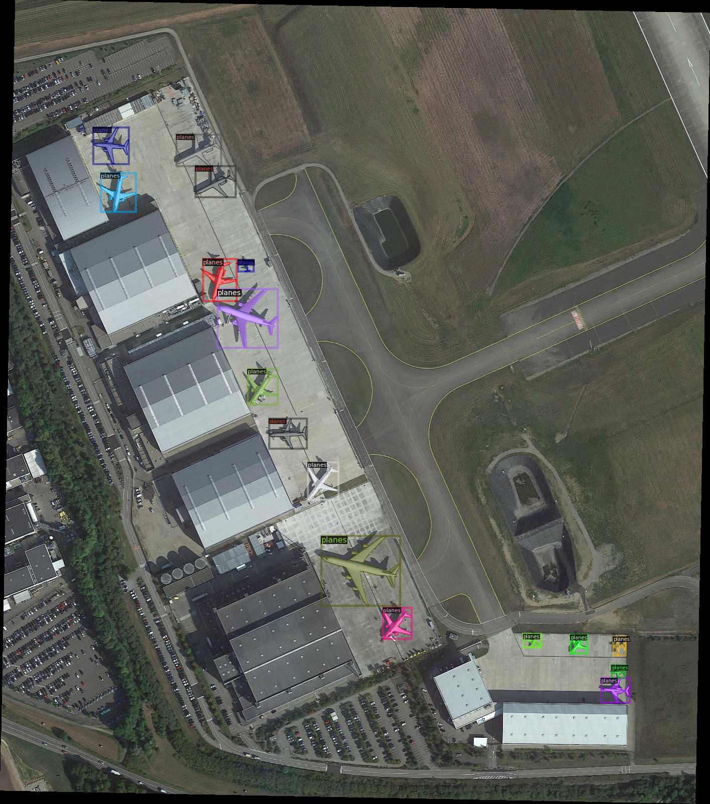
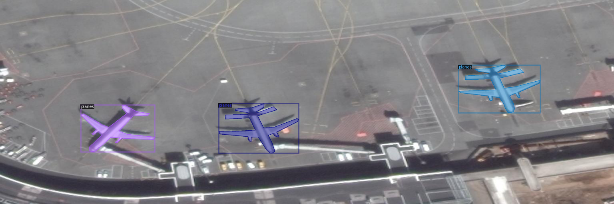
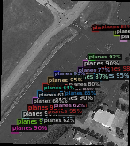
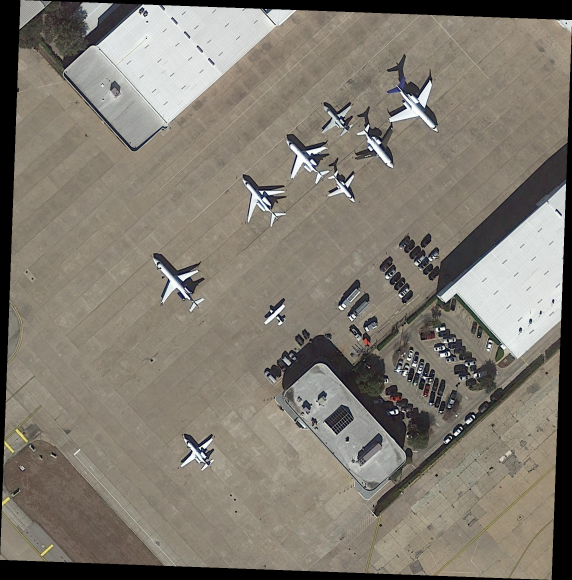
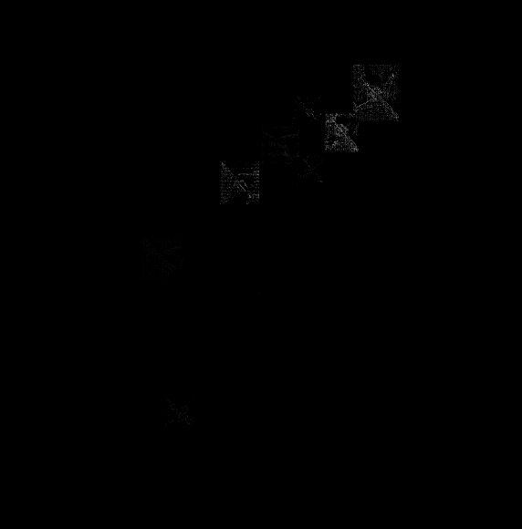
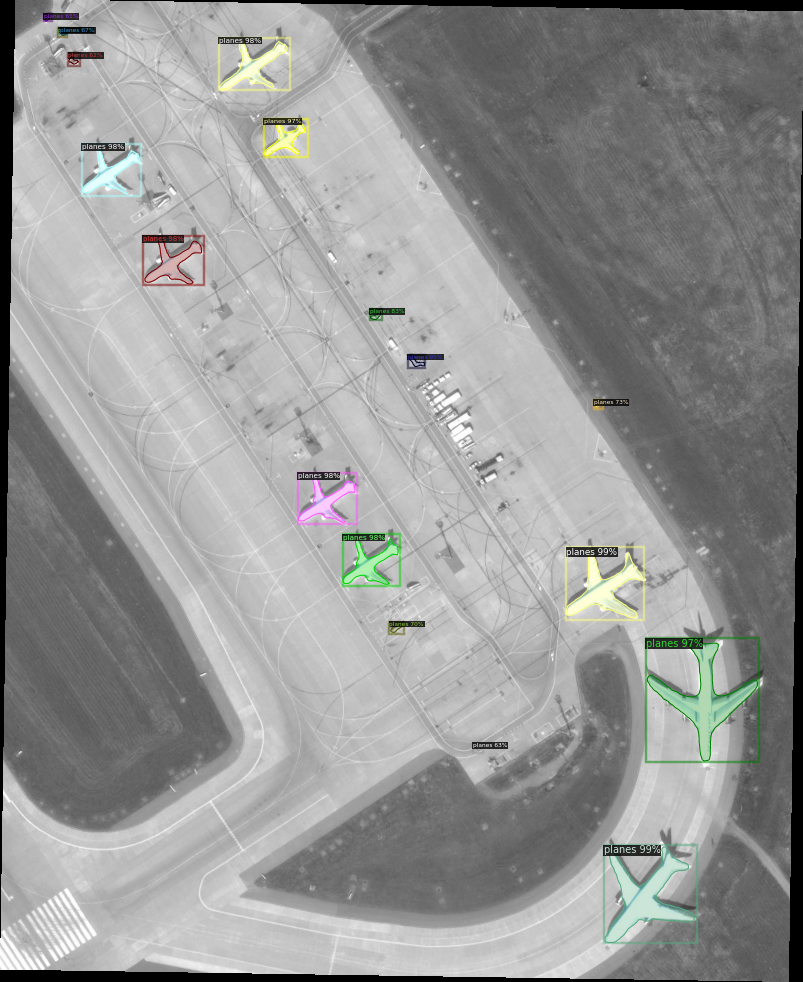

# Plane Object Detection, Semantic Segmentation, and Instance Segmentation

Designing and training deep convolutional neural networks using PyTorch and Detectron2 that improve an object detection framework to detect planes in aerial images. 

## Object Detection

## Semantic Segmentation

## Instance Segmentation

